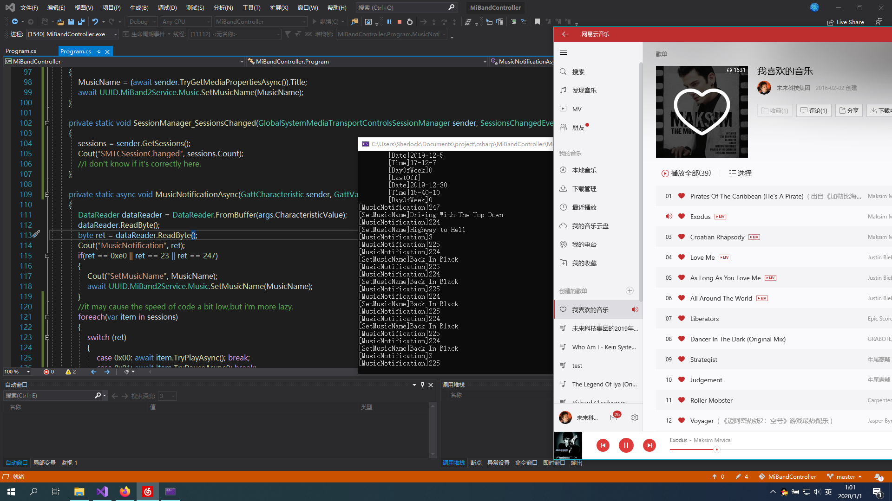

# MiBandController
    A program can control your MiBand on computer.

## What it can be used for?
    1. Control your computer's media playing.
    2. Control your computer's volume.
    3. Transfer your QQ(twitter/facebook/telegram/email/etc.)'s message from your computer to your band.
    4. Unlock your computer system.
    5. etc.
## Now it can do
    1. Get Music UWP APP control session and then control it by miband.
    2. Get miband's information such as battery and time.
    3. Send Alert Message such as phone call,message call.It just send a string to the device.
## What I need to do next
    1. Research how to unlock windows.some windows API...
## Contact with me
    QQ:2836365231
    EMAIL:2836365231@qq.com
    Or you can submit an issue.
## How to develop or use
    Open it with Visual Studio.
    PLEASE CONFIRM THAT YOUR SYSTEM IS WINDOWS 10!!!
    Then fix a WINDOWS 10 SDK LIBRARY PATH.
    Run the project.
## You need a version of code for linux?
    Please see https://github.com/satcar77/miband4
## HAPPY NEW YEAR   :-)